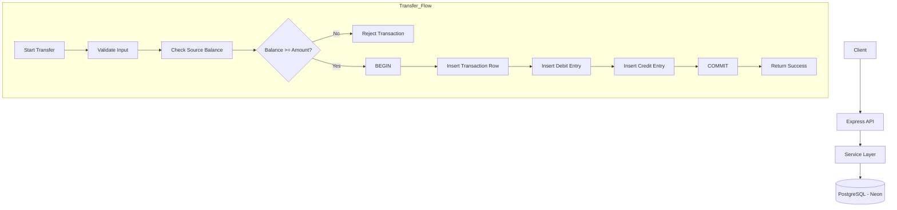
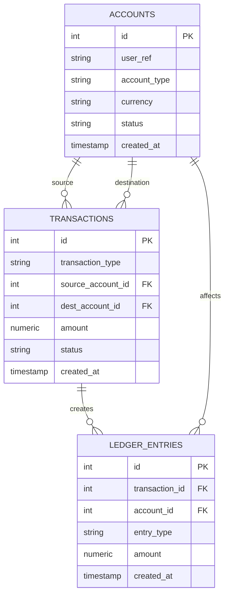

# Financial Ledger API – Double-Entry Bookkeeping System

This project implements a financial ledger service using **Node.js**, **Express**, and **PostgreSQL (Neon)**. All transactions follow the **double-entry bookkeeping model** and enforce **ACID** properties to ensure full financial data integrity.

---

# 🚀 Running the Project Locally

## 1. Clone the Repository
```bash
git clone <your-repo-url>
cd <project-folder>
```

## 2. Install Dependencies
```bash
npm install
```

## 3. Create a `.env` File
Add the following environment variables with your Neon PostgreSQL credentials:

```
DB_HOST=<your-neon-host>
DB_PORT=5432
DB_USER=<your-user>
DB_PASS=<your-password>
DB_NAME=<your-db-name>
PORT=3000
```

## 4. Start the Server
```bash
npm run dev
```

Your API will run at:
```
http://localhost:3000
```

---

# 🧠 Design Decisions

## ✅ 1. Implementation of Double-Entry Bookkeeping

Every financial transaction produces:

### • ONE entry in the `transactions` table  
### • TWO entries in the `ledger_entries` table  
- A **debit**  
- A **credit**

This ensures:
- Debits = Credits  
- Accurate financial tracking  
- No data loss  
- Immutable audit history  

### Example: Deposit ₹1000 into Account 1  
- Credit → Account 1 (+1000)  
- Debit → System account (0) (-1000)

This follows real-world accounting rules.

---

# 🧱 2. Ensuring ACID Properties

### **Atomicity**
Each deposit/withdraw/transfer is wrapped in:

```
BEGIN;
...queries...
COMMIT;
```

If anything fails → `ROLLBACK`.

---

### **Consistency**
- Valid foreign keys  
- Ledger strictly debits/credits always match  
- Balance never goes negative  
- Database schemas enforce correct structure  

---

### **Isolation**
Uses PostgreSQL default:

```
READ COMMITTED
```

This prevents:
- Dirty reads  
- Partial transaction visibility  

The entire transfer operation (debit + credit) happens in one transaction, so no race condition occurs.

---

### **Durability**
Once committed, Neon stores the data permanently even after system crashes.

---

# 💰 3. Balance Calculation & Negative Balance Prevention

Balance is **not stored** in the accounts table.  
It is dynamically calculated from `ledger_entries`:

```sql
SELECT SUM(
    CASE 
        WHEN entry_type='credit' THEN amount
        WHEN entry_type='debit' THEN -amount
    END
) AS balance
FROM ledger_entries
WHERE account_id = $1;
```

### ❗ Negative Balance Protection
Before withdrawal or transfer:

```js
if (balance < amount) {
   throw new Error("Insufficient funds");
}
```

This ensures:
- No overdraft  
- No invalid state after a transaction  

---

# 🏛 Architecture Diagram



---

# 🗂 ERD – Database Schema Diagram



---

# 🔗 API Endpoints Overview

## Accounts
| Method | Endpoint | Description |
|--------|----------|-------------|
| POST | /accounts | Create new account |
| GET | /accounts/:id | Get account with balance |
| GET | /accounts/:id/ledger | Get ledger history |

## Transactions
| Method | Endpoint | Description |
|--------|----------|-------------|
| POST | /transactions/deposit | Deposit money |
| POST | /transactions/withdraw | Withdraw money |
| POST | /transactions/transfer | Transfer between accounts |

---

# 🧪 Postman / Thunder Client Collection

A ready-to-import API collection is included in:
```
postman/financial-ledger-api-collection.json
```

This collection contains:
- All API requests  
- Test body payloads  
- Easy-to-run examples  

---

# 📁 Folder Structure

```
src/
 ├── routes/
 │     ├── accountRoutes.js
 │     └── transactionRoutes.js
 ├── services/
 │     ├── accountService.js
 │     └── transactionService.js
 ├── app.js
 ├── db.js
README.md
.env (not included in repo)
```

---

# ✅ Summary

This backend system:

✔ Implements **true double-entry bookkeeping**  
✔ Enforces **ACID** transactions  
✔ Prevents **negative balances**  
✔ Provides an **immutable ledger**  
✔ Follows professional financial system patterns  
✔ Includes complete documentation for evaluation  

---
